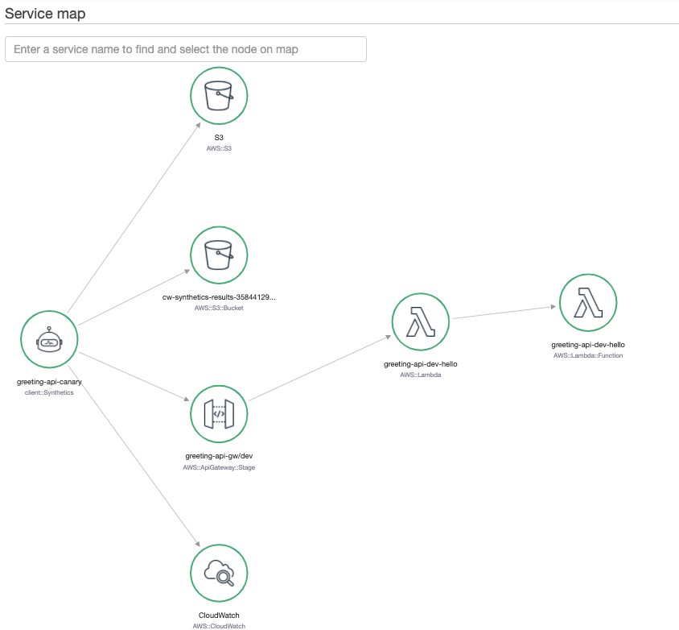

# Overview

This is just a demo api for testing and using AWS Api Gateway features. The API is developed using the [serverless][sls] framework.




## Get Started

1) Clone repo.
2) Configure [AWS credentials](https://docs.aws.amazon.com/cli/latest/userguide/cli-chap-configure.html)
3) Deploy:

```bash
 serverless deploy
```

## Testing


**for ci**:

```
npm run test
```

This is just a simple test implemented to check how `jest` works. These tests are executed on new Pull-Requests for this repository. See [.github/workflows/test.yml](.github/workflows/test.yml).

**locally**:

```
serverless invoke local --function hello --path resources/event.json
```

**deployed stage**

```bash
URL=$(aws cloudformation describe-stacks --stack-name greeting-api-stack --query "Stacks[*].Outputs[?OutputKey=='ServiceEndpoint'].OutputValue" --output text)
curl -v -X POST "${URL}/Brasilia?time=evening" \
        -H 'content-type: application/json' \
        -H 'day: Thursday' \
        -d '{ "callerName": "Jarbas" }'
        
```

## Tracing

Enable AWS X-Ray Tracing setting the environment variable `X_RAY_TRACING` before running a deployment:

```bash
export X_RAY_TRACING=Active
serverless deploy
```

## CloudWatch Synthetics Canary 

Canaries are configurable scripts that run on a schedule to monitor endpoints of API. Canaries simulates the same actions as a user would perform. To launch a canary for `greeting-api`, modify the constant `apiUrl` on the file `resources/canary.yml` with the hostname of your API and launch the Canary as a CloudFormation stack:

```bash
API_HOSTNAME=$(aws cloudformation describe-stacks --stack-name greeting-api-stack --query "Stacks[*].Outputs[?OutputKey=='ServiceEndpoint'].OutputValue" --output text | cut -f3 -d '/')

sed -i.bak "s/{{apiUrl}}/${API_HOSTNAME}/g" resources/canary.yml

aws cloudformation deploy --template-file resources/canary.yml --stack-name CanaryStack --capabilities CAPABILITY_IAM
```

> Note: The steps above can be done manually as well.
> Tracing for the Canary can be activated by changing `Parameters.Tracing` to `true` on `resources/canary.yml`.

## Github Actions Workflow

The workflow uses `sts:AssumeRole` to get [STS credentials][sts] to deploy resources usign a specific deployment role, credentials are retrieved using [configure-aws-credentials][aws-action], follow the README there for setting proper IAM permissions for static credentials stored as GitHub Secrets and assumed role with deployment rights.

### Running Actions Locally

**Pre-requisites**:

- install [nektos/act](https://github.com/nektos/act)
- Configure environment variables:

```bash
export AWS_ACCESS_KEY_ID=access-key
export AWS_SECRET_ACCESS_KEY=secret
export AWS_REGION=region
export AWS_ROLE_TO_ASSUME=role (if different account, this must be role ARN)
export AWS_ROLE_EXTERNAL_ID=externail-id
```

**Run**:

```bash
# simulate push
act -s AWS_ACCESS_KEY_ID -s AWS_SECRET_ACCESS_KEY -s AWS_REGION -s AWS_ROLE_TO_ASSUME -s AWS_ROLE_EXTERNAL_ID
```


[sts]: https://docs.aws.amazon.com/IAM/latest/UserGuide/id_credentials_temp.html
[aws-action]: https://github.com/aws-actions/configure-aws-credentials
[sls]: https://www.serverless.com/framework/docs/providers/aws/